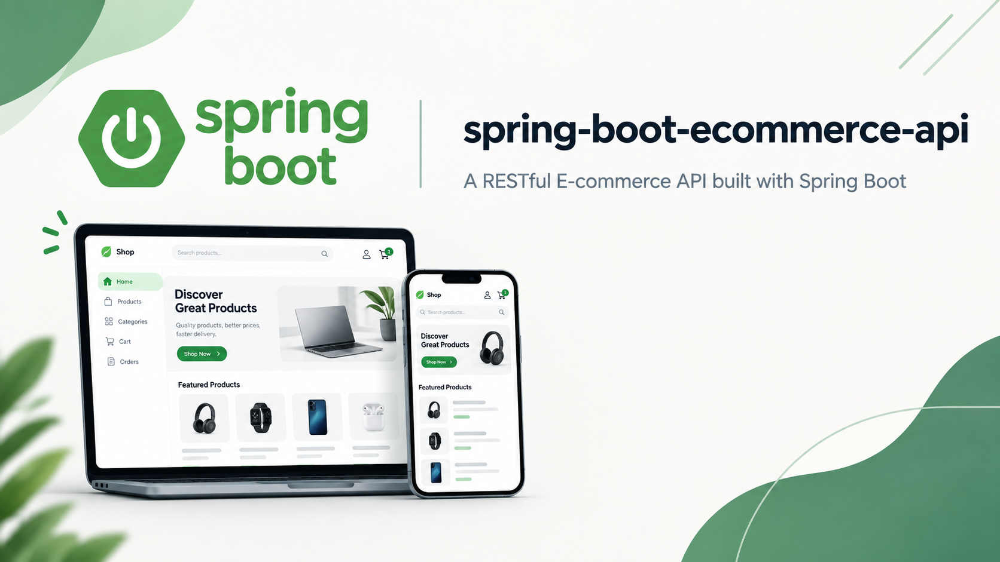
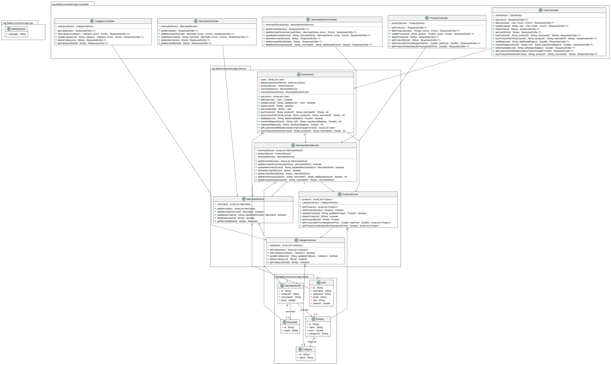

<div align="center">



# Spring Boot E-Commerce API

A lightweight **RESTful e-commerce backend** built with **Spring Boot** that manages users, products, categories, merchants and merchant stock, including wallet features (balance, transfers, discounts and promotions).

</div>

---

## Table of Contents

- [Features](#features)
- [Architecture](#architecture)
- [Tech Stack](#tech-stack)
- [Getting Started](#getting-started)
- [API Reference](#api-reference)
- [Models & Validation](#models--validation)
- [Response Conventions](#response-conventions)
- [Project Structure](#project-structure)
- [Known Limitations](#known-limitations)
- [License](#license)

---

## Features

### Core Resources
Each resource supports full **CRUD** operations: list all, get by ID, add, update and delete.

| Resource | Base Path |
|---|---|
| Users | `/api/v1/user` |
| Products | `/api/v1/product` |
| Categories | `/api/v1/category` |
| Merchants | `/api/v1/merchant` |
| Merchant Stock | `/api/v1/merchantStock` |

### Business Logic & Bonus Endpoints
- **Buy products** directly from a merchant's stock
- **Refund** previously purchased products
- **10% discount** on product purchase with coupon `10Discount` (balance ≥ 1000)
- **Buy one, get one free** promotion with promo code `freeProduct` (balance ≥ 3000)
- **Add / transfer balance** between users
- **Gift customers** (balance ≥ 1000) with +100 once (**admin-only**)
- **Restock** a merchant's product stock
- **Filter products** by price range or by an upper price limit
- **Bean Validation** on every model (see [Models & Validation](#models--validation))

---

## Architecture

The application follows a classic **Controller → Service → Model** layered design. Data is kept **in-memory** (Java `ArrayList`s) and is intentionally reset on every restart.



> A full project presentation is available at [`assets/spring-boot-ecommerce-api.pptx`](assets/spring-boot-ecommerce-api.pptx).

---

## Tech Stack

| Layer | Technology |
|---|---|
| Language | Java 17 |
| Framework | Spring Boot 4.1.1 |
| Web | Spring MVC (`spring-boot-starter-webmvc`, REST controllers) |
| Validation | Jakarta Bean Validation (`spring-boot-starter-validation`) |
| Build tool | Maven (`mvnw` wrapper included) |
| Code generation | Lombok |

---

## Getting Started

### Prerequisites
- **Java 17** (JDK)
- **Maven 3.6+** (optional — the included Maven wrapper can be used instead)

### Run the application
```bash
# Clone the repository
git clone https://github.com/fadhelalmalki/spring-boot-ecommerce-api.git
cd spring-boot-ecommerce-api

# macOS / Linux
./mvnw spring-boot:run

# Windows
mvnw.cmd spring-boot:run
```

The application starts on `http://localhost:8080`. All endpoints are prefixed with `/api/v1`.

---

## API Reference

### Category
Base path: `/api/v1/category`

| Method | Endpoint | Description | Body | Success |
|---|---|---|---|---|
| `GET` | `/get` | Get all categories | — | `200` list of categories |
| `GET` | `/get-by-id/{id}` | Get category by ID | — | `200` category |
| `POST` | `/add` | Add a category | `Category` | `200` `{ "message": "Category added successfully" }` |
| `PUT` | `/update/{id}` | Update a category | `Category` | `200` `{ "message": "Category updated successfully" }` |
| `DELETE` | `/delete/{id}` | Delete a category | — | `200` `{ "message": "Category deleted successfully" }` |

### Product
Base path: `/api/v1/product`

| Method | Endpoint | Description | Body | Success |
|---|---|---|---|---|
| `GET` | `/get` | Get all products | — | `200` list of products |
| `GET` | `/get-by-id/{id}` | Get product by ID | — | `200` product |
| `GET` | `/get-products-by-price-range/{minPrice}/{maxPrice}` | Products within `[minPrice, maxPrice]` | — | `200` list of products |
| `GET` | `/get-products-under-price/{specificPrice}` | Products priced ≤ `specificPrice` | — | `200` list of products |
| `POST` | `/add` | Add a product | `Product` | `200` `{ "message": "Product added successfully" }` |
| `PUT` | `/update/{id}` | Update a product | `Product` | `200` `{ "message": "Product updated successfully" }` |
| `DELETE` | `/delete/{id}` | Delete a product | — | `200` `{ "message": "Product deleted successfully" }` |

### Merchant
Base path: `/api/v1/merchant`

| Method | Endpoint | Description | Body | Success |
|---|---|---|---|---|
| `GET` | `/get` | Get all merchants | — | `200` list of merchants |
| `GET` | `/get-by-id/{id}` | Get merchant by ID | — | `200` merchant |
| `POST` | `/add` | Add a merchant | `Merchant` | `200` `{ "message": "Merchant added successfully" }` |
| `PUT` | `/update/{id}` | Update a merchant | `Merchant` | `200` `{ "message": "Merchant updated successfully" }` |
| `DELETE` | `/delete/{id}` | Delete a merchant | — | `200` `{ "message": "Merchant deleted successfully" }` |

### Merchant Stock
Base path: `/api/v1/merchantStock`

| Method | Endpoint | Description | Body | Success |
|---|---|---|---|---|
| `GET` | `/get` | Get all merchant stock records | — | `200` list of merchant stocks |
| `GET` | `/get-by-id/{id}` | Get merchant stock by ID | — | `200` merchant stock |
| `POST` | `/add` | Add merchant stock | `MerchantStock` | `200` `{ "message": "MerchantStock added successfully" }` |
| `PUT` | `/update/{id}` | Update merchant stock | `MerchantStock` | `200` `{ "message": "MerchantStock updated successfully" }` |
| `PUT` | `/add-stock/{productID}/{merchantID}/{additionalAmount}` | Add stock for a product/merchant | — | `200` `{ "message": "Additional stocks added successfully" }` |
| `DELETE` | `/delete/{id}` | Delete merchant stock | — | `200` `{ "message": "MerchantStock deleted successfully" }` |

### User
Base path: `/api/v1/user`

| Method | Endpoint | Description | Body | Success |
|---|---|---|---|---|
| `GET` | `/get` | Get all users | — | `200` list of users |
| `GET` | `/get-by-id/{id}` | Get user by ID | — | `200` user |
| `POST` | `/add` | Add a user | `User` | `200` `{ "message": "User added successfully" }` |
| `PUT` | `/update/{id}` | Update a user | `User` | `200` `{ "message": "User updated successfully" }` |
| `DELETE` | `/delete/{id}` | Delete a user | — | `200` `{ "message": "User deleted successfully" }` |
| `POST` | `/buy-product/{id}/{productID}/{merchantID}` | Buy a product | — | `200` `{ "message": "Product bought successfully" }` |
| `POST` | `/buy-product-discount/{id}/{productID}/{merchantID}/{coupon}` | Buy a product with 10% discount (coupon `10Discount`, balance ≥ 1000) | — | `200` `{ "message": "Product bought successfully" }` |
| `POST` | `/buy-product-offer/{id}/{productID}/{merchantID}/{promoCode}` | Buy one, get one free (promo code `freeProduct`, balance ≥ 3000) | — | `200` `{ "message": "Product bought successfully" }` |
| `PUT` | `/refund-product/{id}/{productID}/{merchantID}` | Refund a previously purchased product | — | `200` `{ "message": "Product refunded successfully" }` |
| `PUT` | `/add-balance/{id}/{additionalBalance}` | Add balance to a user | — | `200` `{ "message": "Additional balance added successfully, new balance: ..." }` |
| `PUT` | `/transfer-balance/{fromID}/{toID}/{transferredBalance}` | Transfer balance between users | — | `200` `{ "message": "Money transferred successfully" }` |
| `PUT` | `/gift-customers/{adminID}` | Admin-only: gift +100 to customers with balance ≥ 1000 (once) | — | `200` list of gifted users / `403` for non-admins |

---

## Models & Validation

All validation failures return `400` with `{ "message": "<validation error>" }`.

### User
| Field | Rules |
|---|---|
| `id` | Required, min 3 chars |
| `username` | Required, min 6 chars |
| `password` | Required, min 7 chars, must contain letters **and** digits |
| `email` | Required, must be a valid email |
| `role` | Required, `admin` or `customer` only |
| `balance` | Required, must be positive |

### Product
| Field | Rules |
|---|---|
| `id` | Required, min 3 chars |
| `name` | Required, min 4 chars |
| `price` | Required, must be positive |
| `categoryID` | Required, min 3 chars, must reference an existing category |

### Category
| Field | Rules |
|---|---|
| `id` | Required, min 3 chars |
| `name` | Required, min 4 chars |

### Merchant
| Field | Rules |
|---|---|
| `id` | Required, min 3 chars |
| `name` | Required, min 4 chars |

### MerchantStock
| Field | Rules |
|---|---|
| `id` | Required, min 3 chars |
| `productID` | Required, min 3 chars, must reference an existing product |
| `merchantID` | Required, min 3 chars, must reference an existing merchant |
| `stock` | Required, min **11** at creation |

---

## Response Conventions

- **Success (list)** → `200` with a JSON array of entities.
- **Success (entity)** → `200` with the entity as-is.
- **Success / failure (action)** → `200`/`400` with a uniform response object:
  ```json
  { "message": "Human readable message" }
  ```
- **Validation errors** → `400` with the failing field's message.
- **Authorization** → `403` for admin-only actions (e.g. `gift-customers`) when the caller is not an admin.
- **Data persistence** → in-memory `ArrayList` storage; **all data resets on restart**.

---

## Project Structure

```
src/main/java/org/fadhel/ecommerceapi
├── ECommerceApiApplication.java  # Spring Boot entry point
├── Api
│   └── ApiResponse.java          # Uniform { message } response wrapper
├── Controller
│   ├── CategoryController.java
│   ├── MerchantController.java
│   ├── MerchantStockController.java
│   ├── ProductController.java
│   └── UserController.java
├── Model
│   ├── Category.java
│   ├── Merchant.java
│   ├── MerchantStock.java
│   ├── Product.java
│   ├── Purchase.java
│   └── User.java
└── Service
    ├── CategoryService.java
    ├── MerchantService.java
    ├── MerchantStockService.java
    ├── ProductService.java
    └── UserService.java
```

---

## Known Limitations

- **No database** — data lives in-memory and is lost on restart.
- **Non-standard REST design** — actions use paths like `/get`, `/add`, `/update/{id}` rather than conventional REST verbs and resource nouns.
- **No global exception handler** — validation and error handling are done per-controller.
- **No authentication / authorization** — any client can call any endpoint.
- **No pagination / sorting / search** beyond the two price filters.
- **Buying is not transactional-safe** — no lock/atomicity (in-memory only).

### Possible Future Work
- Add a persistent store (PostgreSQL, MySQL, or H2) via Spring Data JPA.
- Introduce OpenAPI/Swagger documentation.
- Add Spring Security + JWT authentication and role-based access.
- Centralize error handling with `@RestControllerAdvice`.
- Refactor endpoints to a conventional RESTful design.
- Add comprehensive integration tests.